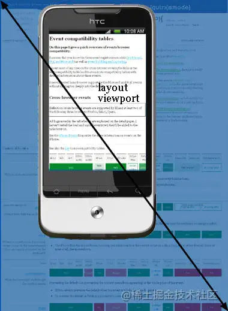
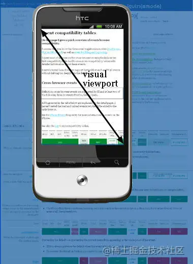

# 1.1、响应式设计 - 像素
像素单位有设备像素、逻辑像素、CSS 像素 3 种。

## 1.1.1、设备像素、设备分辨率
设备像素也叫物理像素，指的是显示器上的真实像素，每个像素的大小是屏幕固有的属性，屏幕出厂以后就不会再改变。<br />设备分辨率描述的就是这个显示器的宽和高分别是多少个设备像素，例如常见的显示器的分辨率为 1920 * 1080。<br />设备像素和设备分辨率是由操作系统来管理的，浏览器不知道、也不必知道设备分辨率的大小，它主要根据逻辑分别率来计算的。

## 1.1.2、设备独立像素、逻辑分辨率
设备独立像素是操作系统定义的一种像素单位，应用程序将设备独立像素告诉操作系统，操作系统再将设备独立像素转化为设备像素，从而控制屏幕上真正的物理像素点<br />用设备独立像素定义的尺寸，不管屏幕的参数如何，都能以合适的大小显示。<br />操作系统是如何做到的呢？对于那些像素密度高的屏幕，将多个设备像素划分为一个逻辑像素。至于将多少设备像素划分为一个逻辑像素，这由操作系统决定。<br />“原本高度为 12 个设备像素的字体，现在高度为 24 个设备像素才能得到相同的大小”，操作系统会将一个逻辑像素定义为 2*2个 真实像素，从而设备独立像素尺寸不需要改变，而且不管在新、旧设备上，显示的尺寸大致相同。

逻辑分辨率用屏幕的 宽_高 来表示（单位：设备独立像素）例如屏幕的设备分辨率是1920*_1200（单位：设备像素），我们可以在当前的分辨率下设置逻辑分辨率是1280*800（单位：设备独立像素）。那么横、纵方向的设备像素数量恰好是设备独立像素的1.5倍。这也意味着，设备独立像素的边长是设备像素边长的1.5倍。 

## 1.1.3、CSS 像素
在 CSS 中使用的 px 都是指 css 像素，比如 width: 128px。css 像素的大小是很容易变化的，当我们缩放页面的时候，元素的 css 像素数量不会改变，改变的只是每个 css 像素的大小。也就是说 width: 128px 的元素在缩放200% 以后，宽度依然是 128 个 css 像素，只不过每个 css 像素的宽度和高度变为原来的两倍。如果原本元素宽度为 128 个设备独立像素，那么缩放 200% 以后元素宽度为 256 个设备独立像素。<br />**（1）css 像素与设备独立像素的关系**

- 缩放比例就是 css 像素边长/设备独立像素边长；
- 在缩放比例为 100% 的情况下，1 个 css 像素大小等于 1 个设备独立像素；
- 在缩放比例为 200% 的情况下，1 个 css 像素大小等于 (2 * 2) 个设备独立像素；

**（2）css 像素与设备像素的关系**<br />window.devicePixelRatio 设备像素比，devicePixelRatio = （在相同长度的直线上）设备像素的数量 / CSS 像素的数量。这个比例也等价于 CSS 像素边长/设备像素边长。如 devicePixelRatio = 2，表示在相同长度的直线上，设备像素的数量是 CSS 像素数量的 2 倍，因此 CSS 像素的边长是设备像素的 2 倍。缩放会导致 CSS 像素边长的改变，从而导致 window.devicePixelRatio 的改变！

# 1.2、响应式设计 - viewport
viewport 表示浏览器的可视区域，也就是浏览器中用来显示网页的那部分区域。存在三种 viewport 分别为 layout viewport、visual viewport 以及 ideal viewport，我们接下来分别介绍三种。

## 1.2.1、layout viewport
layout viewport 为布局视口，即网页布局的区域，它是 html 元素的父容器，只要不在 css 中修改 元素的宽度， 元素的宽度就会撑满 layout viewport 的宽度。<br />很多时候浏览器窗口没有办法显示出 layout viewport 的全貌，但是它确实是已经被加载出来了，这个时候滚动条就出现了，你需要通过滚动条来浏览 layout viewport 其他的部分。<br />layout viewport 用 css 像素来衡量尺寸，在缩放、调整浏览器窗口的时候不会改变。缩放、调整浏览器窗口改变的只是 visual viewport。 <br />在桌面浏览器中，缩放100% 的时候，Layout Viewport 宽度等于内容窗口的宽度。（你几乎不会在电脑上见过横向滚动条，除非你调整缩放）<br />但是在移动端，缩放为 100% 的时候，Layout Viewport 不一定等于内容窗口的大小。当你用手机浏览浏览宽大的网页（这些网页没有采用响应式设计）的时候，你只能一次浏览网页的一个部分，然后通过手指滑动浏览其他部分。这就说明整个网页（Layout Viewport）已经加载出来了，只不过你要一部分一部分地看。<br />

## 1.2.2、visual viewport
visual viewport 为视觉视口，就是显示在屏幕上的网页区域，它往往只显示 layout viewport 的一部分。<br />visual viewport 就像一台摄像机，layout viewport 就像一张纸，摄像机对准纸的哪个部分，你就能看见哪个部分。你可以改变摄像机的拍摄区域大小（调整浏览器窗口大小），也可以调整摄像机的距离（调整缩放比例），这些方法都可以改变 visual viewport，但是 layout viewport 始终不变。<br />

## 1.2.3、ideal viewport
ideal viewport 为理想视口，不同的设备有自己不同的 ideal viewport，ideal viewport 的宽度等于移动设备的屏幕宽度，所以其是最适合移动设备的 viewport。只要在 css 中把某一元素的宽度设为 ideal viewport 的宽度(单位用 px )，那么这个元素的宽度就是设备屏幕的宽度了，也就是宽度为100% 的效果。 ideal viewport 的意义在于，无论在何种分辨率的屏幕下，那些针对ideal viewport 而设计的网站，不需要用户手动缩放，也不需要出现横向滚动条，都可以完美的呈现给用户。

## 1.2.4、利用 meta 标签对 viewport 进行控制
移动设备默认的 viewport 是 layout viewport，也就是那个比屏幕要宽的 viewport，但在进行移动设备网站的开发时，我们需要的是 ideal viewport。那么怎么才能得到 ideal viewport 呢？<br />我们在开发 h5 页面时，最经常见的标签如下所示.
```javascript
<meta name="viewport" content="width=device-width, initial-scale=1.0, maximum-scale=1.0, user-scalable=0">
```
该 meta 标签的作用是让当前 viewport 的宽度等于设备的宽度，同时不允许用户手动缩放。如果你不这样的设定的话，那就会使用那个比屏幕宽的默认 viewport（layout viewport），也就是说会出现横向滚动条。<br />相关的属性意义如下所示

| width | 设置 layout viewport 的宽度，为一个正整数，或字符串 "width-device" |
| --- | --- |
| height | 设置页面的初始缩放值，为一个数字，可以带小数 |
| initial-scale | 允许用户的最小缩放值，为一个数字，可以带小数 |
| minimum-scale | 允许用户的最大缩放值，为一个数字，可以带小数 |
| maximum-scale | 设置 layout viewport 的高度，这个属性对我们并不重要，很少使用 |
| user-scalable | 是否允许用户进行缩放，值为"no"或"yes", no 代表不允许，yes 代表允许 |

