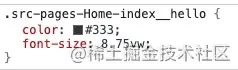

# 1、使用 css 的媒体查询 @media
基于 css 的媒体查询属性 @media 分别为不同屏幕尺寸的移动设备编写不同尺寸的 css 属性，示例如下所示。虽然此方法能在一定程度上解决移动设备适配的问题，但我们也可以看出其存在以下问题，所以其已几乎被历史潮流淘汰。

- 页面上所有的元素都得在不同的 @media 中定义一遍不同的尺寸，这个代价有点高；
- 如果再多一种屏幕尺寸，就得多写一个 @media 查询块；
```css
@media only screen and (min-width: 375px) {
  .logo {
    width : 62.5px;
  }
}

@media only screen and (min-width: 360px) {
  .logo {
    width : 60px;
  }
}

@media only screen and (min-width: 320px) {
  .logo {
    width : 53.3333px;
  }
}

```

# 2、使用 rem 单位
rem（font size of the root element）是指相对于根元素的字体大小的单位，如果我们设置 html 的 font-size 为 16px，则如果需要设置元素字体大小为 16px，则写为 1rem。但是其还是必须得借助 @media 属性来为不同大小的设备设置不同的 font-size，相对上一种方案，可以减少重复编写相同属性的代价，简单示例如下所示。<br />我们也能看到该方案存在以下问题：

- 不同的尺寸需要写多个 @media；
- 所有涉及到使用 rem 的地方，全部都需要调用方法 calc() ，这个也挺麻烦的；
```css
@media only screen and (min-width: 375px) {
  html {
    font-size : 375px;
  }
}

@media only screen and (min-width: 360px) {
  html {
    font-size : 360px;
  }
}

@media only screen and (min-width: 320px) {
  html {
    font-size : 320px;
  }
}

//定义方法：calc
@function calc($val){
    @return $val / 1080;
}

.logo{
	width : calc(180rem);
}
```

# 3、flexible 适配方案
在 rem 方案上进行改进，我们可以使用 js 动态来设置根字体，这种方案的典型代表就是 [flexible 适配方案](https://link.juejin.cn/?target=https%3A%2F%2Fgithub.com%2Famfe%2Flib-flexible)。

## 3.1、 使用 rem 模拟 vw 特性适配多种屏幕尺寸
它的核心代码如下所示
```javascript
// set 1rem = viewWidth / 10
function setRemUnit () {
    var rem = docEl.clientWidth / 10
    docEl.style.fontSize = rem + 'px'
}
setRemUnit();
```
上面的代码中，将 html 节点的 font-size 设置为页面 clientWidth(布局视口)的 1/10，即 1rem 就等于页面布局视口的 1/10，这就意味着我们后面使用的 rem 都是按照页面比例来计算的。

## 3.2、控制 viewport 的 width 和 scale 值适配高倍屏显示
设置 viewport 的 width 为 device-width，改变浏览器 viewport（布局视口和视觉视口）的默认宽度为理想视口宽度，从而使得用户可以在理想视口内看到完整的布局视口的内容。<br />等比设置 viewport 的 initial-scale、maximum-scale、minimum-scale 的值，从而实现 1 物理像素=1 css像素，以适配高倍屏的显示效果（就是在这个地方规避了大家熟知的“1px 问题”）
```javascript
var metaEL= doc.querySelector('meta[name="viewport"]');
var dpr = window.devicePixelRatio;
var scale = 1 / dpr
metaEl.setAttribute('content', 'width=device-width, initial-scale=' + scale + ', maximum-scale=' + scale + ', minimum-scale=' + scale + ', user-scalable=no'); 

```

## 3.3、flexible 的缺陷
不可否认 flexible 在兼容性不友好的某个时期还是极大帮助来成千上万的开发者，但是该方案自身是存在一些问题的。

- 由于其缩放的缘故，video 标签的视频频播放器的样式在不同 dpr 的设备上展示差异很大；
- 如果你去研究过 lib-flexible 的源码，那你一定知道 lib-flexible 对安卓手机的特殊处理，即：一律按 dpr = 1 处理；
```javascript
if (isIPhone) {
  // iOS下，对于2和3的屏，用2倍的方案，其余的用1倍方案
  if (devicePixelRatio >= 3 && (!dpr || dpr >= 3)) {                
    dpr = 3;
  } else if (devicePixelRatio >= 2 && (!dpr || dpr >= 2)){
    dpr = 2;
  } else {
    dpr = 1;
  }
} else {
  // 其他设备下，仍旧使用1倍的方案
  dpr = 1;
}
```

- 不再兼容 @media 的响应式布局，因为 @media 语法中涉及到的尺寸查询语句，查询的尺寸依据是当前设备的物理像素，和 flexible 的布局理论（即针对不同 dpr 设备等比缩放视口的 scale 值，从而同时改变布局视口和视觉视口大小）相悖，因此响应式布局在“等比缩放视口大小”的情境下是无法正常工作的；

其实 flexible 方案是在 模拟 viewport 功能，只是随着浏览器的发展及兼容性增强，viewport 已经能兼容绝大部分主流浏览器，并且 flexible 方案自身存在的问题，所有其也已几乎退出历史潮流。引用 [lib-flexible](https://link.juejin.cn?target=https%3A%2F%2Fgithub.com%2Famfe%2Flib-flexible) 的 github 主页的原话：

# 4、viewport 适配方案
由于 viewport 单位得到众多浏览器的兼容，所以目前基于 viewport 的移动端适配方案被各大厂团队所采用。<br />vw 作为布局单位，从底层根本上解决了不同尺寸屏幕的适配问题，因为每个屏幕的百分比是固定的、可预测、可控制的。 viewport 相关概念如下：

- vw：是 viewport's width 的简写，1vw 等于 window.innerWidth 的 1%；
- vh：和 vw 类似，是 viewport's height 的简写，1vh 等于 window.innerHeihgt 的 1%；
- vmin：vmin 的值是当前 vw 和 vh 中较小的值；
- vmax：vmax 的值是当前 vw 和 vh 中较大的值；

假设我们拿到的视觉稿宽度为 750px，视觉稿中某个字体大小为 75px，则我们的 css 属性只要如下这么写，不需要额外的去用 js 进行设置，也不需要去缩放屏幕等；
```javascript
.logo {
  font-size: 10vw; // 1vw = 750px * 1% = 7.5px
}
```

## 4.1、设置 meta 标签
在 html 头部设置 mata 标签如下所示，让当前 viewport 的宽度等于设备的宽度，同时不允许用户手动缩放。
```javascript
<meta name="viewport" content="width=device-width, initial-scale=1.0, maximum-scale=1.0, user-scalable=0">
```

## 4.2、px 自动转换为 vw
设计师一般给宽度大小为 375px 或 750px 的视觉稿，我们采用 vw 方案的话，需要将对应的元素大小单位 px 转换为 vw 单位，这是一项影响开发效率（需要手动计算将 px 转换为 vw）且不利于后续代码维护（css 代码中一堆 vw 单位，不如 px 看的直观）的事情；好在社区提供了 [postcss-px-to-viewport](https://link.juejin.cn?target=https%3A%2F%2Fgithub.com%2Fevrone%2Fpostcss-px-to-viewport) 插件，来将 px 自动转换为 vw，相关配置步骤如下：<br />**（1） 安装插件**<br />`npm install postcss-px-to-viewport --save-dev`<br />**（2）webpack 配置**<br />官网是使用 glup 进行配置，但是我们项目模版中是使用 webpack 进行 postcss 插件以及相关样式插件的配置，所以我们就使用 webpack 进行配置使用，不需要额外引入 gulp 编译；webpack 相关配置如下，且每个属性表示的意义进行了备注：
```javascript
module.exports = {
  plugins: {
    // ...
    'postcss-px-to-viewport': {
      // options
      unitToConvert: 'px',    // 需要转换的单位，默认为"px"
      viewportWidth: 750,     // 设计稿的视窗宽度
      unitPrecision: 5,       // 单位转换后保留的精度
      propList: ['*', '!font-size'],        // 能转化为 vw 的属性列表
      viewportUnit: 'vw',     // 希望使用的视窗单位
      fontViewportUnit: 'vw', // 字体使用的视窗单位
      selectorBlackList: [],  // 需要忽略的 CSS 选择器，不会转为视窗单位，使用原有的 px 等单位
      minPixelValue: 1,       // 设置最小的转换数值，如果为 1 的话，只有大于 1 的值会被转换
      mediaQuery: false,      // 媒体查询里的单位是否需要转换单位
      replace: true,          // 是否直接更换属性值，而不添加备用属性
      exclude: undefined,     // 忽略某些文件夹下的文件或特定文件，例如 'node_modules' 下的文件
      include: /\/src\//,     // 如果设置了include，那将只有匹配到的文件才会被转换
      landscape: false,       // 是否添加根据 landscapeWidth 生成的媒体查询条件
      landscapeUnit: 'vw',    // 横屏时使用的单位
      landscapeWidth: 1125,   // 横屏时使用的视窗宽度
    },
  },
};
```
相关配置属性，通过注释一目了然其作用，其中需要强调的点为 propList 属性，我们配置了 font-size 不进行转换 vw，也就是说在不同手机屏幕尺寸下的字体大小是一样的。 其中 font-size 是否需要根据屏幕大小做适配，或者怎么做，一直是个争论不休的话题；考虑到我们移动端没有平板的需求，且咨询过团队业务设计师的意见，所以对模版进行以上默认配置；当然如果你的视觉要求你的项目要做字体大小适配，修改 propList 属性的配置即可。<br />**（3）效果展示** 我们在项目代码中，进行如下 css 编码：
```css
.hello {
  color: #333;
  font-size: 28px;
}
```
启动项目，我们可以看到浏览器渲染的页面中，postcss-px-to-viewport 已经帮我们做进行了 px -> vw 的转换；如下所示：<br />

## 4.3、标注不需要转换的属性
在项目中，如果设计师要求某一场景不做自适配，需为固定的宽高或大小，这时我们就需要利用 postcss-px-to-viewport 插件的 Ignoring 特性，对不需要转换的 css 属性进行标注，示例如下所示：

- /* px-to-viewport-ignore-next */ —> 下一行不进行转换.
- /* px-to-viewport-ignore */ —> 当前行不进行转换
```css
2.4.3、标注不需要转换的属性
在项目中，如果设计师要求某一场景不做自适配，需为固定的宽高或大小，这时我们就需要利用 postcss-px-to-viewport 插件的 Ignoring 特性，对不需要转换的 css 属性进行标注，示例如下所示：

/* px-to-viewport-ignore-next */  —> 下一行不进行转换.
/* px-to-viewport-ignore */  —> 当前行不进行转换
```
