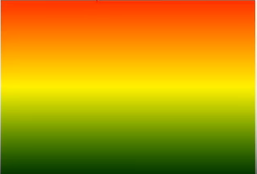
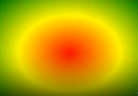

可以在两个或者多个指定的颜色之间显示平稳的过渡，css3定义了两种类型的渐变


# 线性渐变

```css
background-image:linear-gradient(directiom,color1,color2,...)//direction可以是向下，向上，向左，向右，角度
可以是background-image和background
```


# 径向渐变

```css
background:radial-gradient(circle at 20px 20px,blue,yellow)
中心(at center center)  
    (at x y )都是从左上角原点为参考 xy可以是像素吗，也可以是百分比
形状
    ellipse 椭圆 默认值
    circle  原型

```
