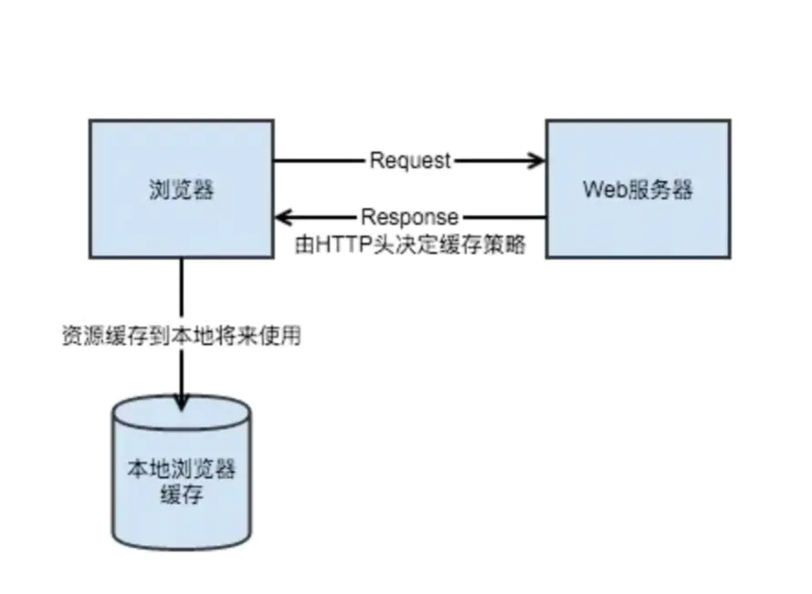

# dns缓存：
dns解析：简单的说,通过域名,最终得到该域名对应的IP地址的过程叫做域名解析（或主机名解析） 有dns的地方,就有缓存。浏览器、操作系统、Local DNS、根域名服务器，它们都会对DNS结果做一定程度的缓存。 DNS查询过程如下:

1. 首先搜索浏览器自身的DNS缓存,如果存在，则域名解析到此完成。
1. 如果浏览器自身的缓存里面没有找到对应的条目，那么会尝试读取操作系统的hosts文件看是否存在对应的映射关系,如果存在，则域名解析到此完成。
1. 如果本地hosts文件不存在映射关系，则查找本地DNS服务器(ISP服务器,或者自己手动设置的DNS服务器),如果存在,域名到此解析完成。
1. 如果本地DNS服务器还没找到的话,它就会向根服务器发出请求,进行递归查询。

# 浏览器缓存

简单来说,浏览器缓存其实就是浏览器保存通过HTTP获取的所有资源,是浏览器将网络资源存储在本地的一种行为。

## 缓存的资源去哪里了?

### memory cache

MemoryCache顾名思义，**就是将资源缓存到内存中**，等待下次访问时不需要重新下载资源，而直接从内存中获取。Webkit早已支持memoryCache。 目前Webkit资源分成两类，一类是主资源，比如HTML页面，或者下载项，一类是派生资源，比如HTML页面中内嵌的图片或者脚本链接，分别对应代码中两个类：MainResourceLoader和SubresourceLoader。虽然Webkit支持memoryCache，但是也只是针对派生资源，它对应的类为CachedResource，用于保存原始数据（比如CSS，JS等），以及解码过的图片数据。

### disk cache
DiskCache顾名思义，**就是将资源缓存到磁盘中**，等待下次访问时不需要重新下载资源，而直接从磁盘中获取，它的直接操作对象为CurlCacheManager。

| - | memory cache | disk cache |
| --- | --- | --- |
| 相同点 | 只能存储一些派生类资源文件 | 只能存储一些派生类资源文件 |
| 不同点 | 退出进程时数据会被清除 | 退出进程时数据不会被清除 |
| 存储资源 | 一般脚本、字体、图片会存在内存当中 | 一般非脚本会存在内存当中，如css等 |

## 三级缓存原理 (访问缓存优先级)

1. 先在内存中查找,如果有,直接加载。
1. 如果内存中不存在,则在硬盘中查找,如果有直接加载。
1. 如果硬盘中也没有,那么就进行网络请求。
1. 请求获取的资源缓存到硬盘和内存。
