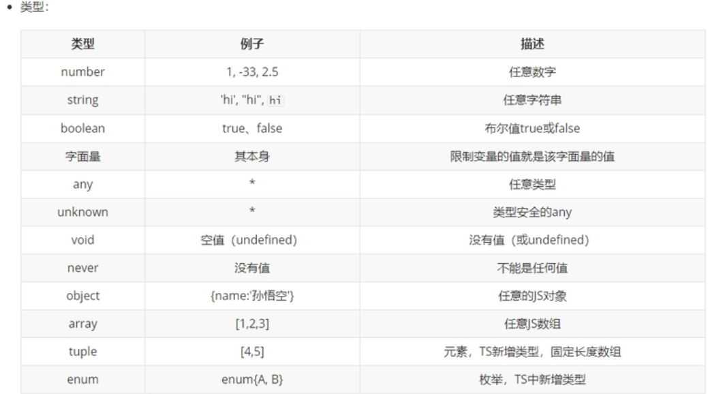

# 声明方式

变量声明是可以指定类型，类型确定后无法更改
```typescript
//声明变量并指定类型
let a:number;
a=10;
a='avc';//此处会报错
//声明变量不指定类型并且赋值 TS会判断变量类型并确认类型，无法更改
let c=false//确认类型false
c=123//会报错 

let d:string|number//d可以为string或者number

```
也可直接使用字面量进行类型声明
```typescript
let a:10 //此时a只能等于数字10
a=10;
a=11//报错

let d:"true"|"false"//d可以为true或者false
```

函数的参数也可指定类型
```typescript
function sum(a:number,b:number){//此时指定了形参a,b的类型
    return a+b
}
console.log(sum(1,5))//6
console.log(sum(1,'4'));//报错，类型已确认
console.log(sum(1,5,7));//报错，参数个数已确认：参数个数不能多或少

```
函数的返回值也可以指定类型
```typescript
function sum2(a,b): number{
    return a+b
}
sum2(1,'2')//12
```

# 新增类型

## any
```typescript
let f:any;//没有类型的约束
let e;//不指定类型也会为any类型，隐式any
f=10;
f="hello"

let g:string;
g=f//此时g的类型也发生了变化

```
使用TS时不建议使用any类型


## unknown
表示未知类型的值
```typescript
let h:unknown;
h="hello"
let g:string;
g=h//报错
//类型断言
g=h as string//不报错
g=<string>h//不报错
```
相当于一个类型安全的any<br />但是无法此类型的值无法赋值给其他任意变量

## void
用来表示空<br />意为函数无返回值
```typescript
function fn():void{
    return 123//报错 
}
function fn():void{
    return//不报错 
    retrun undefind//不报错
}
```

## never
表示永远不返回结果<br />常用于报错时
```typescript
function fn():never{
	throw new Error("报错了")
}
```

## object
```typescript
//表示一个js对象
let a:object
a={}
a=function(){
}
//此类方法不常用，因为不会有约束效果

let b:{name:string};

b={name:'孙悟空'};
b={name:123};//报错
b={name:'孙悟空',age:18}//报错
//{}用来指定对象中可以包括哪些属性
//语法：{属性名:属性值;属性名:属性值}
//在属性名后面加上?,表示属性是可选的

let c:{name:string,age?:number};//此时age变为了可选
c={name:'张三'}//不报错
c={name:'张三',age:15}//不报错


let d:{name:string,[propName:string]:any};
//表示只有name属性是必须且限制类型的,其他属性可以随意添加,且无类型限制
d={name:'张三',a=10,b="123"}//不报错
d={a=10,b="123"}//报错

/*
	设置函数结构的类型声明：
  		语法：(形参:类型,形参:类型 ...)=>返回值类型
*/
let e:(a:number,b:number)=>number;

e=function(n1,n2){
	return n1+n2
}//此函数参数和返回值类型必须是number，参数个数只能有两个

let f:{name:string}&{age:number};//&表示同时
j={name:'孙悟空',age:18}

```

## array
声明方式<br />类型[]<br />Array<类型>
```typescript
let a:string[];//表示字符串
e=['a','b','c'];

let f:number[];//表示数值数组
let g:Array<number>;//也表示数值数组
```


## tuple
元组:固定长度的数组
```typescript
let a:[string,string]
h=['hello','a']//不报错
h=['hello']//报错
h=['hello','a','b']//报错
```

## enum 
枚举 <br />使用枚举类型可以为一组数值赋予友好的名字。
```typescript
//定义枚举
enum Gender{
	male=0,
  female=1
}
let i:{name:string,gender:Gender};
i={
	name:'Lis',
  gender:Gender.male
}
console.log(i.gender)//0
```

## 类型的别名
```typescript
type myType=1|2|3|4;//定义一个类型
let k: myType;
k=1//不报错
k=11//报错
```
