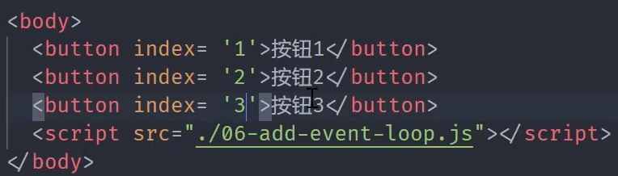
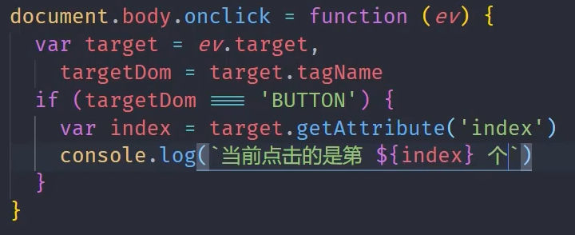
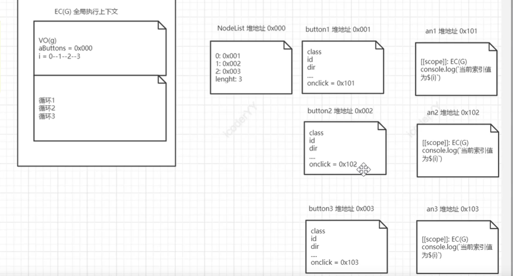
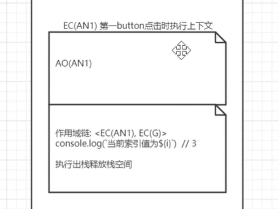
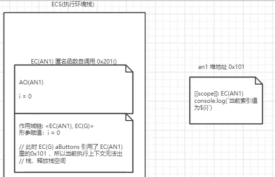

# 基本

```javascript
var aButtons=document.querySelectorAll('button')

for(var i=0;i<aButtons.length;i++){ 
	aButtons[i].onclick=function(){
	console.log(`当前索引值为${i}`)
  }
}
```
此时点击每一个按钮都会输出 “当前索引值为3”<br />因为当函数被触发时，**引用的i 为全局变量中的**i，而当循环结束时，i就等于3了

而当var改成let时也能正确的输出 var会有一个变量提升


# 闭包

```javascript
var aButtons=document.querySelectorAll('button')

for(var i=0;i<aButtons.length;i++){
	function(i){
  aButtons[i].onclick=function(){
	console.log(`当前索引值为${i}`)
  }
  }(i)
}
```
此时会正确输出对应的索引值，<br />因为此时输出索引的函数在被调用时 i的取值**取自闭包函数的外层函数中**


# 事件委托




可以正确输出，并且是性能最优化的解法，


# 底层执行分析


## 基本
```javascript
var aButtons=document.querySelectorAll('button')

//每一次便利循环都会创建button和匿名函数的堆地址，并且让button中的onclick与对应的你们函数的地址相关联
for(var i=0;i<aButtons.length;i++){ 
	aButtons[i].onclick=function(){
	console.log(`当前索引值为${i}`)
  }
}
```



当点击事件被触发时：因为匿名函数AN1的执行上下文的作用域链为**<当前执行上下文，全局执行上下文>**<br />所以当输出索引时 i在当前执行上下文中未找到 所以**使用全局执行上下文中的i**，而全局中的i已经循环结束变成了3




## 闭包


```javascript
var aButtons=document.querySelectorAll('button')

for(var i=0;i<aButtons.length;i++){
	function(i){
  aButtons[i].onclick=function(){
	console.log(`当前索引值为${i}`)
  }
  }(i)
}
```
循环遍历时，匿名函数AN1中的形参i被赋值，并且创建一个新的匿名函数an1 并被绑定到onclick事件，<br />而当onclick被调用时，an1的作用域链为<自身执行上下文,AN1执行上下文><br />而i在AN1中被找到，为正确的i


