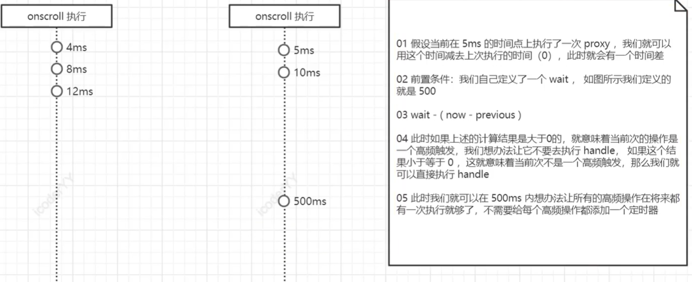

指的是在自定义的一段时间内让事件进行触发


# 原理
 


```javascript
function myThrottle(handle, wait) {
        if (typeof handle !== "function")
          throw new Error("handle must be a function")
        if (typeof wait === "undefined") wait = 400

        let previous = 0 //定义变量记录上一次执行的时间
        let timer = null //来管理定时器
        return function proxy(...args) {
          let now = new Date() //定义变量记录当前执行的时刻点
          let self = this
          let interval = wait - (now - previous)
          if (interval <= 0) {
            handle.call(self, ...args)

            //防止当浏览器检查的时间和我们自己定义的时间相同使if和elseif同时触发
            clearTimeout(timer)
            timer = null

            previous = new Date()
          } else if (!timer) {
            //当我们发现当前系统有一个定时器了，就意味着我们不需要再开启定时器
            //此时就说明这次的操作发生在了我们定义的频次时间范围内，那就不应该执行handle

            //如果没有定时器 就应该定义一个定时器让handle在 interval之后去执行
            timer = setTimeout(() => {
              clearTimeout(timer)
              timer = null //clearTimeout只是清楚定时器，但是timer的值还在

              handle.call(self, ...args)
              previous = new Date()
            }, interval)
          }
        }
      }
```
