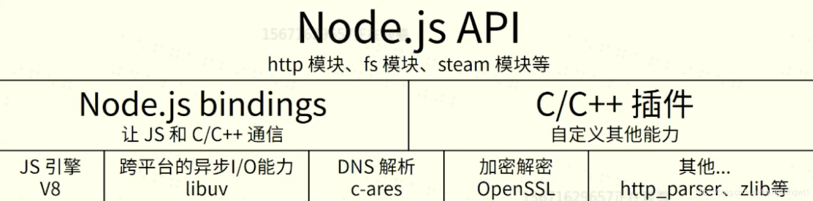
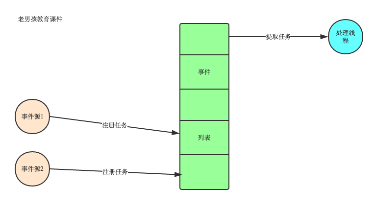

## Node.js架构

### Natives modules(最上层)

- 当前层内容由js实现
- 提供应用程序可直接调用库，例如fs模块、path模块、steam模块
- JS语言无法直接操作底层硬件设置

### Builtin modules（中间层）
js无法直接操作底层硬件设置，Builtin modules 就是JS与硬件设备之间通信的桥梁 Builtin modules 封装 V8 引擎 和 Libuv 的细节，向上层提供基础 API 服务。 举个例子：C/C++ 实现了一个 http_parser 的库，非常高效，但是前端开发人员只会写 JavaScript，直接调用这个库肯定是不能成功的，所以就需要一个中间的桥梁。于是 Node.js 的作者就用 C++ 对 http_parser 库进行封装，使它符合某些要求（比如统一数据类型等），封装的文件叫做 http_parser_bindings.cpp。同时 Node.js 提供的编译工具可以将其编译为.node文件。这样 JavaScript 代码可以直接 require 这个 .node 文件，这样 JavaScript 就能调用 C++ 库

### 底层
底层是支撑 Node.js 运行的关键，**由 C/C++ 实现**

#### V8
V8使用C++开发，在运行JavaScript之前，相比其它的JavaScript的引擎转换成字节码或解释执行，V8将其编译成原生机器码，并且使用了如内联缓存等方法来提高性能。

**执行JS代码,提供桥梁接口**

我们的js代码是跑在v8引擎上面的，这句话怎么理解呢？** 首先v8会将js源代码变成本地代码并执行；维护调用栈，保证js的执行顺序；为所有对象分配内存；垃圾回收；实现js的标准库。**

#### libuv
libuv是一个**跨平台异步IO库**。**因为Nodejs是单线程的，作为服务器，他涉及到IO,而IO是会阻塞的，从而影响性能**。**所以Nodejs把IO操作交给libuv，保证主线程可以继续处理其他事情**。Libuv做了什么？Libuv主要是，**利用系统提供的事件驱动模块解决网络异步IO，利用线程池解决文件IO**。另外还实现了定时器，对进程，线程等使用进行了封装。

libuv 采用了 **异步** (asynchronous), **事件驱动** (event-driven)的编程风格, 其主要任务是为开人员提供了一套事件循环和基于I/O(或其他活动)通知的回调函数, libuv 提供了一套核心的工具集, 例如定时器, 非阻塞网络编程的支持, 异步访问文件系统, 子进程以及其他功能.

##### 事件驱动和异步IO
目前大部分的UI编程都是事件驱动模型，如很多UI平台都会提供onClick()事件，这个事件就代表鼠标按下事件。事件驱动模型大体思路如下：

1. 有一个事件（消息）队列；
1. 鼠标按下时，往这个队列中增加一个点击事件（消息）；
1. 有个循环，不断从队列取出事件，根据不同的事件，调用不同的函数，如onClick()、onKeyDown()等；
1. 事件（消息）一般都各自保存各自的处理函数指针，这样，每个消息都有独立的处理函数；

**异步IO提高性能不用原地等待结果返回**
