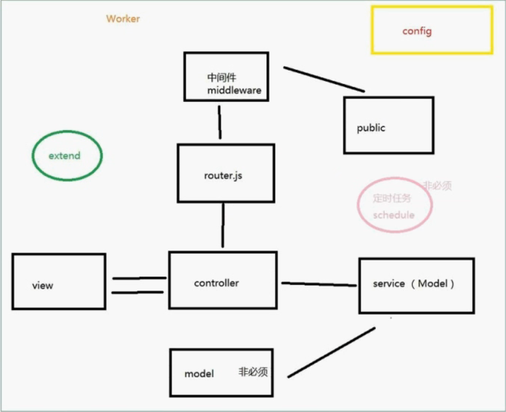

 

# app	

## controller
放置控制器 负责处理一些业务逻辑

## public
静态资源（css,js,images）

## routers
配置路由

## view（可选）
放置页面模板

## service
和数据打交道（查询数据库，请求数据） 调用方法： **this.service.文件名**

互相之间也可以调用

## middleware
匹配路由之前和匹配路由完成进行一系列操作

## extend
扩展的方法

- Application
- Context
- Request
- Response
- Helper（工具的方法）

上述对应的js文件中放置方法到对应的部分 可以通过this.app,this.ctx等直接访问
