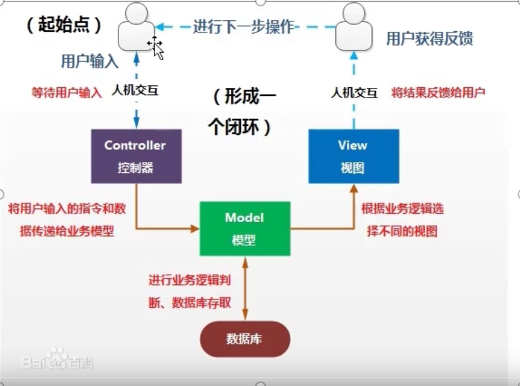
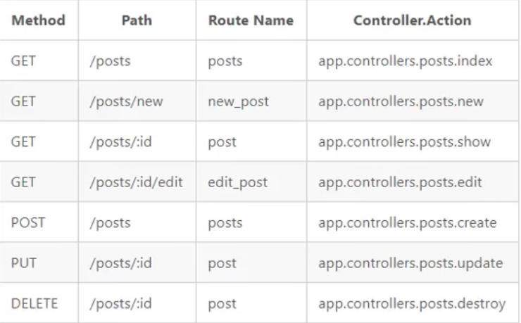

# MVC概述
**MVC是模型(model)-视图(view)-控制器(controller)的缩写**

MVC是一种软件设计规范，主要作用就是逻辑拆分：

1. 视图为用户展示数据
1. 控制器用来处理用户输入
1. 模型用于处理数据

# Egg中的控制器（controller）

1. 直接响应数据或渲染模板
1. 接受用户的输入
1. 与路由建立对应关系

this.ctx可以获取到当前请求的上下文对象，通过次对象可以便捷的获取到请求与响应的属性和方法

Egg中的路由：app/router.js文件

# RESTful风格的URL定义
可以简化路由文件 router.resources('posts','/api/posts',controller.posts)；//一个方法同时定义增删改查

