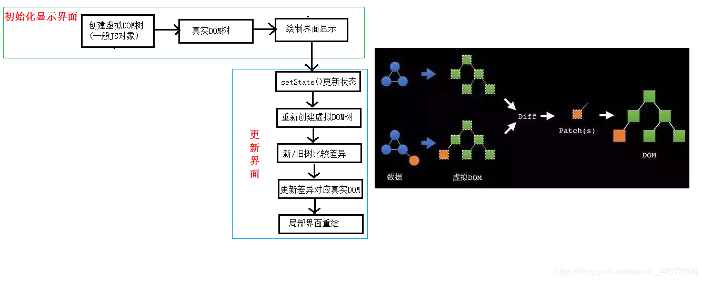
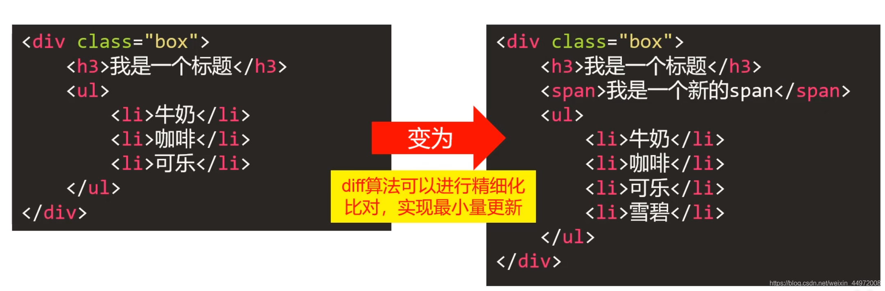

## 虚拟DOM

## 用普通js对象来描述DOM结构，因为不是真实DOM，所以称之为虚拟DOM。
虚拟 dom 是相对于浏览器所渲染出来的真实 dom而言的，在[react](https://so.csdn.net/so/search?q=react&spm=1001.2101.3001.7020)，vue等技术出现之前，我们要改变页面展示的内容只能通过遍历查询 dom 树的方式找到需要修改的 dom 然后修改样式行为或者结构，来达到更新 ui 的目的。

## 基本原理

比较虚拟DOM与真实DOM，没有发生变化的不需要重绘，有变化的地方进行重绘

**最小量更新**


## 

## 关于key的问题

1. [react](https://so.csdn.net/so/search?q=react&spm=1001.2101.3001.7020)/vue中的key有什么作用？（key的内部原理是什么？）

  	1). 简单的说: key是虚拟DOM对象的标识, 在更新显示时key起着极其重要的作用。<br />2). 详细的说: 当状态中的数据发生变化时，react会根据【新数据】生成【新的虚拟DOM】, 随后React进行【新虚拟DOM】与【旧虚拟DOM】的diff比较，比较规则如下：<br />	
```diff
a. 旧虚拟DOM中找到了与新虚拟DOM相同的key：
	(1).若虚拟DOM中内容没变, 直接使用之前的真实DOM
	(2).若虚拟DOM中内容变了, 则生成新的真实DOM，随后替换掉页面中之前的真实DOM
b. 旧虚拟DOM中未找到与新虚拟DOM相同的key
	根据数据创建新的真实DOM，随后渲染到到页面
```

2. 为什么遍历列表时，key最好不要用index?

用index作为key可能会引发的问题:

1. 若对数据进行：**逆序添加、逆序删除等破坏顺序**操作:

会产生没有必要的真实DOM更新 ==> **界面效果没问题, 但效率低**

2. 如果结构中还包含**输入类**的DOM：

会产生错误DOM更新 ==> **界面有问题**

3. 注意！如果不存在对数据的逆序添加、逆序删除等破坏顺序操作，仅用于渲染列表用于展示，使用index作为key是没有问题的


## 开发中如何选择key？

1. 最好使用每条数据的唯一标识作为key, 比如id、手机号、身份证号、学号等唯一值
1. 如果确定只是简单的展示数据，用index也是可以的（但是会有效率问题）


