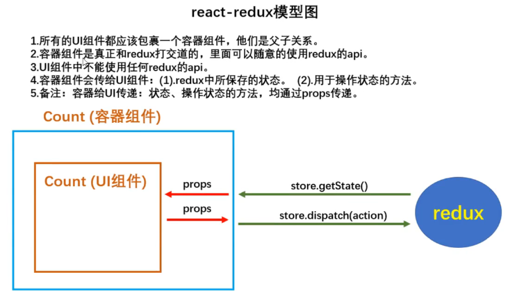

react-redux把组件分为了两类：**UI组件**和**容器组件**

1. UI组件
   - 只负责 UI 的呈现，不带有任何业务逻辑
   - 通过props接收数据(一般数据和函数)
   - 不使用任何 Redux 的 API
   - 一般保存在components文件夹下

2. 容器组件	
   - 负责管理数据和业务逻辑，不负责UI的呈现
   - 使用 Redux 的 API
   - 一般保存在containers文件夹下

模型图
