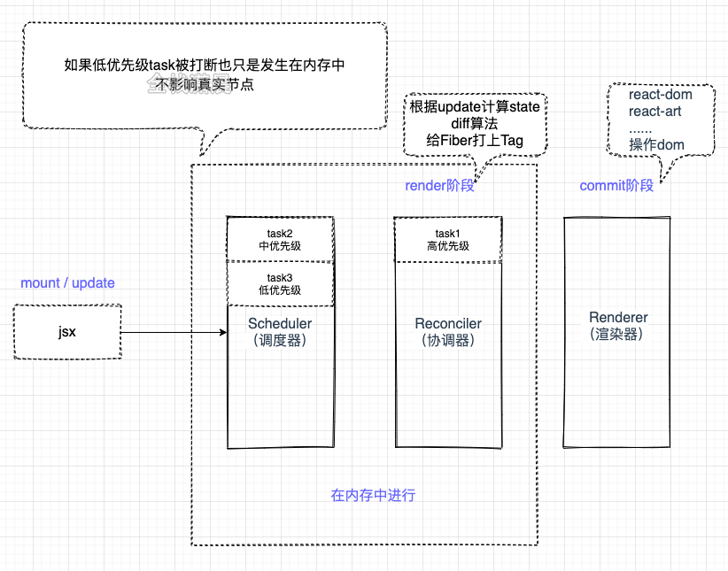
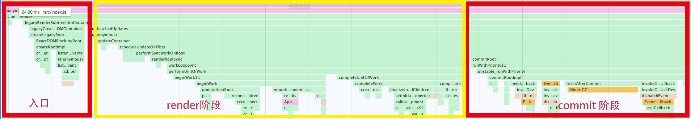

react的核心可以用`ui=fn(state)`来表示，更详细可以用
```css
const state = reconcile(update);
const UI = commit(state);
```
上面的fn可以分为如下一个部分：

- Scheduler（调度器）： 排序优先级，让优先级高的任务先进行reconcile
- Reconciler（协调器）： 找出哪些节点发生了改变，并打上不同的Flags（旧版本react叫Tag）
- Renderer（渲染器）： 将Reconciler中打好标签的节点渲染到视图上



