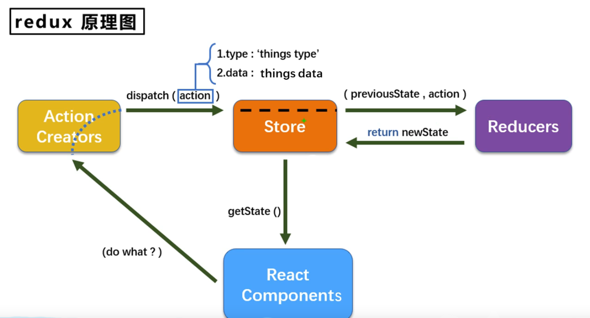

# action

1. 动作的对象
1. 包含2个属性 
- type:标识属性，值为字符串，唯一，必要属性
- data:数据属性，值类型任意，可选属性
3. 例子：{type:'ADD',data:{name:'tom'}}

# reducer

1. 用于初始化状态，加工状态
1. 加工时，根据旧的state和action，产生新的state的**纯函数**

 

# store

1. 将state,action,reducer联系在一起的对象
1. 如何得到此对象

