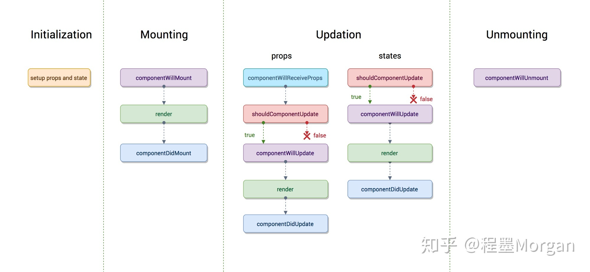
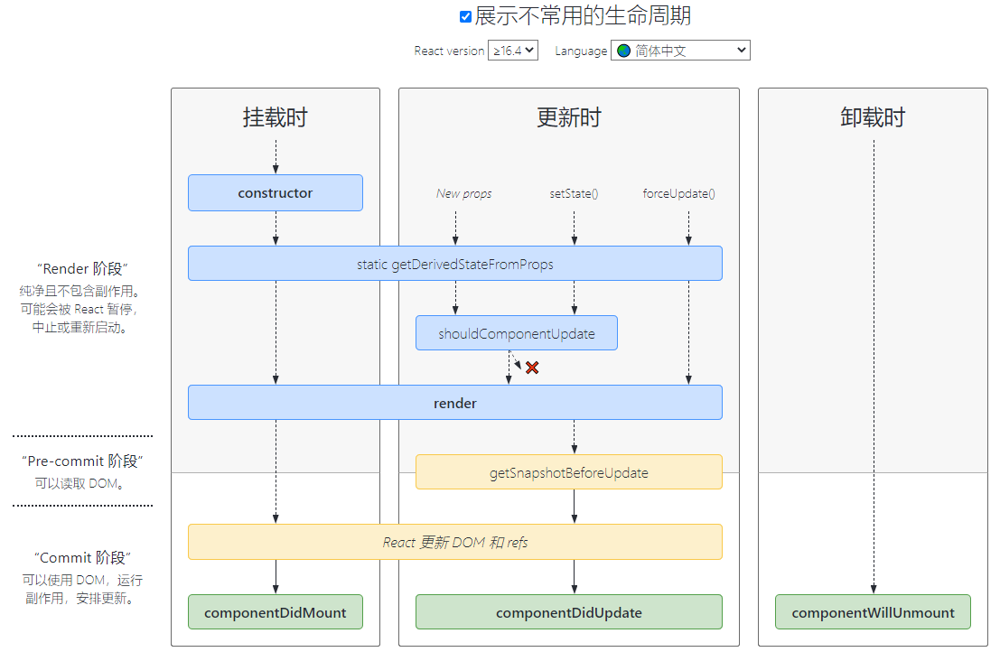

# 16.3以及以前的版本：

# 16.3以后的版本的生命周期函数：

随着getDerivedStateFromProps的推出，同时deprecate了一组生命周期API，包括：

- componentWillReceiveProps
- componentWillMount
- componentWillUpdate

去除了render之前的除了shouldComponentUpdate之外的所有生命周期函数 因为太多错用滥用这些生命周期函数的做法，预期追求对称的美学，不如来点实际的，让程序员断了在这些生命周期函数里做些不该做事情的念想。

##  

### getDerivedStateFromProps
每当父组件引发当前组件的渲染过程时，getDerivedStateFromProps会被调用，这样我们有一个机会可以根据新的props和之前的state来调整新的state。

### 
