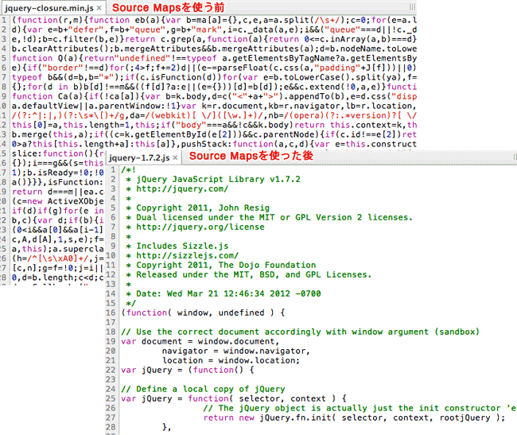

JavaScript脚本正变得越来越复杂。大部分源码（尤其是各种函数库和框架）都要经过转换，才能投入生产环境。 常见的源码转换，主要是以下三种情况： （1）压缩，减小体积。比如jQuery 1.9的源码，压缩前是252KB，压缩后是32KB。 （2）多个文件合并，减少HTTP请求数。 （3）其他语言编译成JavaScript。最常见的例子就是CoffeeScript。 这三种情况，都使得实际运行的代码不同于开发代码，除错（debug）变得困难重重。 通常，JavaScript的解释器会告诉你，第几行第几列代码出错。但是，这对于转换后的代码毫无用处。 这就是Source map想要解决的问题。

简单说，Source map就是一个信息文件，里面储存着位置信息。也就是说，转换后的代码的每一个位置，所对应的转换前的位置。 有了它，出错的时候，除错工具将直接显示原始代码，而不是转换后的代码。这无疑给开发者带来了很大方便。

