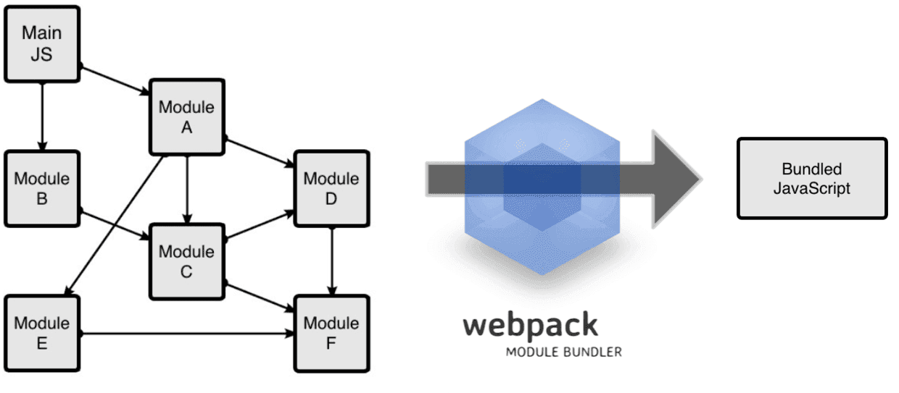

## [webpack 是什么？](https://malun666.github.io/aicoder_vip_doc/#/pages/vip_2webpack?id=webpack-%e6%98%af%e4%bb%80%e4%b9%88%ef%bc%9f)
本质上，webpack 是一个现代 JavaScript 应用程序的静态模块打包器(module bundler)。当 webpack 处理应用程序时，它会递归地构建一个依赖关系图(dependency graph)，其中包含应用程序需要的每个模块，然后将所有这些模块打包成一个或多个 bundle。



### [mode 开发模式](https://malun666.github.io/aicoder_vip_doc/#/pages/vip_2webpack?id=mode-%e5%bc%80%e5%8f%91%e6%a8%a1%e5%bc%8f)
webpack 提供 mode 配置选项，配置 webpack 相应模式的内置优化。
```c
// webpack.production.config.js
module.exports = {
+  mode: 'production',
}
```

### [入口文件(entry)](https://malun666.github.io/aicoder_vip_doc/#/pages/vip_2webpack?id=%e5%85%a5%e5%8f%a3%e6%96%87%e4%bb%b6entry)
入口文件，类似于其他语言的起始文件。比如：c 语言的 main 函数所在的文件。<br />入口起点(entry point)指示 webpack 应该使用哪个模块，来作为构建其内部依赖图的开始。进入入口起点后，webpack 会找出有哪些模块和库是入口起点（直接和间接）依赖的。<br />可以在 webpack 的配置文件中配置入口，配置节点为： entry,当然可以配置一个入口，也可以配置多个。

### [输出(output)](https://malun666.github.io/aicoder_vip_doc/#/pages/vip_2webpack?id=%e8%be%93%e5%87%baoutput)
output 属性告诉 webpack 在哪里输出它所创建的 bundles，以及如何命名这些文件。
```c
const path = require('path');

module.exports = {
  entry: './path/to/my/entry/file.js',
  output: {
    path: path.resolve(__dirname, 'dist'),
    filename: 'my-first-webpack.bundle.js'
  }
};
```

### [loader](https://malun666.github.io/aicoder_vip_doc/#/pages/vip_2webpack?id=loader)
loader 让 webpack 能够去处理那些非 JavaScript 文件（webpack 自身只理解 JavaScript）。loader 可以将所有类型的文件转换为 webpack 能够处理的有效模块，然后你就可以利用 webpack 的打包能力，对它们进行处理。

### [插件(plugins)](https://malun666.github.io/aicoder_vip_doc/#/pages/vip_2webpack?id=%e6%8f%92%e4%bb%b6plugins)
loader 被用于转换某些类型的模块，而插件则可以用于执行范围更广的任务。插件的范围包括，从打包优化和压缩，一直到重新定义环境中的变量。插件接口功能极其强大，可以用来处理各种各样的任务。
