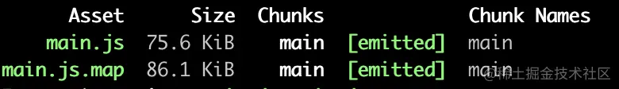
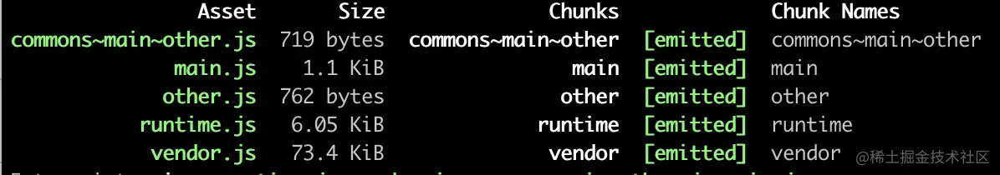

## Chunk VS Module
Chunk是Webpack打包过程中，一堆module的集合。我们知道Webpack的打包是从一个入口文件开始，也可以说是入口模块，入口模块引用这其他模块，模块再引用模块。Webpack通过引用关系逐个打包模块，这些module就形成了一个Chunk。<br />如果我们有多个入口文件，可能会产出多条打包路径，一条路径就会形成一个Chunk。出了入口entry会产生Chunk，还有两种途径，下面会有介绍。

## Chunk VS Bundle
通常我们会弄混这两个概念，以为Chunk就是Bundle，Bundle就是我们最终输出的一个或多个打包文件。确实，大多数情况下，一个Chunk会生产一个Bundle。但有时候也不完全是一对一的关系，比如我们把 devtool配置成'source-map'。然后只有一个入口文件，也不配置代码分割：
```javascript
// webpack配置
 entry: {
    main: __dirname + "/app/main.js",
 },
 output: {
    path: __dirname + "/public",//打包后的文件存放的地方
    filename: "[name].js", //打包后输出文件的文件名
  },
 devtool: 'source-map',
```
这样的配置，会产生一个Chunk，但是会产生两个bundle，如下图<br />注意到Chunk Names那列，只有main这么一个Chunk，再看Asset这一列，产生了两个bundle，还有一个.map文件。<br />这就是Chunk和Bundle的区别，Chunk是过程中的代码块，Bundle是结果的代码块。

# 产生Chunk的三种途径

1. entry入口
1. 异步加载模块
1. 代码分割（code spliting）

## entry产生Chunk
entry的配置有三种方式：

### 传递一个字符串
`entry: './src/js/main.js',`<br />这种情况只会产生一个Chunk。（这里只说entry对Chunk的影响，不涉及代码分割）

### 传递数组
`entry: ['./src/js/main.js','./src/js/other.js'],`<br />这种情况也只会产生一个Chunk。Webpack会将数组里的源代码，最终都打包到一个Bundle里，原因就是只生成了一个Chunk.

### 传递对象
```javascript
entry: {
    main: './src/js/main.js',
    other: './src/js/other.js'
},
output: {
    // path: __dirname + "/public",
    // filename:'bundle.js'
    // 以上2行会报错 

    path: __dirname + "/public",//打包后的文件存放的地方
    filename: "[name].js", //打包后输出文件的文件名

}
```
对象中一个字段就会产生一个Chunk，所以在output中filename直接写死名称，会报错。因为上面的配置，产生了两个Chunk，最终会生成两个Bundle，一个名称肯定不够用了。需要用[name]变量来利用entry下的字段名称，作为生成Bundle们的名称。<br />这里面entry的key，也被用来当作它对应的Chunk的名称，上面传递一个字符串和传递数组两种方式，没有key，也会默认给生成的Chunk一个main的名称。

## 异步产生Chunk
除了入口文件会影响Chunk，异步加载的模块，也需要生成Chunk。
```javascript
{
    entry: {
        "index": "pages/index.jsx"
    },
    output: {
         filename: "[name].min.js",
        chunkFilename: "[name].min.js"
    }
}
const myModel = r => require.ensure([], () => r(require('./myVue.vue')), 'myModel')
```
这个时候chunkFilename字段就派上用场了，为异步加载的Chunk命名。

## 代码分割产生Chunk
我们来分析一下，下面代码会产生几个Chunk，其中main.js文件和two.js文件，都引用了同一个greeter.js文件。main.js中使用了react。
```javascript
module.exports = {
  entry: {
    main: __dirname + "/app/main.js",
    other: __dirname + "/app/two.js",
  },
  output: {
    path: __dirname + "/public",//打包后的文件存放的地方
    filename: "[name].js", //打包后输出文件的文件名
    chunkFilename: '[name].js',
  },

  optimization: {
    runtimeChunk: "single",
    splitChunks: {
      cacheGroups: {
        commons: {
          chunks: "initial",
          minChunks: 2,
          maxInitialRequests: 5, // The default limit is too small to showcase the effect
          minSize: 0 // This is example is too small to create commons chunks
        },
        vendor: {
          test: /node_modules/,
          chunks: "initial",
          name: "vendor",
          priority: 10,
          enforce: true
        }

      },
    }
  }
}

```
答案是5个，两个入口分别产生一个， runtimeChunk: "single"会将Webpack在浏览器端运行时需要的代码单独抽离到一个文件，commons下的配置会产生一个Chunk，vendor下的配置会产生一个Chunk。如下图。<br />
