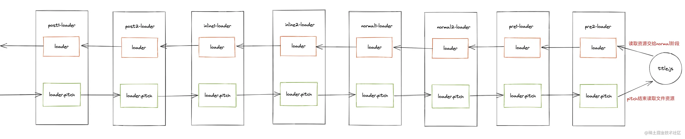
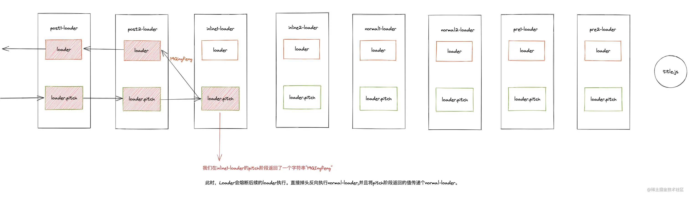

**文章连接：**[https://juejin.cn/post/7036379350710616078](https://juejin.cn/post/7036379350710616078)
**loader就是一个函数，通过它我们可以在webpack处理我们的特定资源(文件)之前进行提前处理**。<br />比方说，webpack仅仅只能识别javascript模块，而我们在使用TypeScript编写代码时可以提前通过babel-loader将.ts后缀文件提前编译称为JavaScript代码，之后再交给Webapack处理


## Loader配置相关API

### 常用基础配置参数
```javascript
module.exports = {
  module: {
    rules: [
      { test: /.css$/, use: 'css-loader',enforce: 'post' },
      { test: /.ts$/, use: 'ts-loader' },
    ],
  },
};
```
相信这段配置代码大家已经耳熟能详了，我们通过module中的rules属性来配置loader。

#### test
test是一个正则表达式，我们会对应的资源文件根据test的规则去匹配。如果匹配到，那么该文件就会交给对应的loader去处理。

#### use
use表示匹配到test中匹配对应的文件应该使用哪个loader的规则去处理，use可以为一个字符串，也可以为一个数组。<br />如果use为一个数组时表示有多个loader依次处理匹配的资源，按照 **从右往左(从下往上)** 的顺序去处理。

#### enforce
如果希望`loader`执行顺序可以不根据书写的顺序执行可以使用`enforce`
```javascript
module.exports = {
  module: {
    rules: [
      { test: /.css$/, use: 'sass-loader', enforce: 'pre' },
      { test: /.css$/, use: 'css-loader' },
      { test: /.css$/, use: 'style-loader', enforce: 'post' },
    ],
  },
};

```
enforce有两个值分别为pre、post。

- 当我们的rules中的规则没有配置enforce参数时,默认为normal loader(默认loader)。
- 当我们的rules中的规则配置enforce:'pre'参数时,我们称之它为pre loader(前置loader)。
- 当我们的rules中的规则配置enforce:'post'参数时,我们称之它为post loader(后置loader)。

**正常loader** 的执行阶段这三种类型的loader执行顺序为:<br />

## loader配置方法

### 绝对路径
第一种方式在项目内部存在一些未发布的自定义loader时比较常见，**直接使用绝对路径地址的形式指向loader文件所在的地址。**
```javascript
const path = require('path')
// webpack.config.js
module.exports = {
    ...
    module: {
        rules: [
            {
                test:/\.js$/,
                loader: path.resolve(__dirname,'../loaders/babel-loader.js')
            }
        ]
    }
}
```
传入一个绝对路径的形式，直接去该路径查找对应的loader所在的js文件。

### resolveLoader.alias
通过webpack中的resolveLoader的别名alias方式进行配置
```javascript
const path = require('path')
// webpack.config.js
module.exports = {
    ...
    resolveLoader: {
        alias: {
            'babel-loader': path.resolve(__dirname,'../loaders/babel-loader.js')
        }
    },
    module: {
        rules: [
            {
                test:/\.js$/,
                loader: 'babel-loader'
            }
        ]
    }
}
```
当webpack在解析到loader中使用babel-loader时，查找到alias中定义了babel-loader的文件路径。就会按照这个路径查找到对应的loader文件从而使用该文件进行处理。不过我们定义loader时如果每一个loader都需要定义一次resolveLoader.alias的话无疑太过于冗余了

### resolveLoader.modules
我们可以通过resolveLoader.modules定义webpack在解析loader时应该查找的目录
```javascript
const path = require('path')
// webpack.config.js
module.exports = {
    ...
    resolveLoader: {
        modules: [ path.resolve(__dirname,'../loaders/') ]
    },
    module: {
        rules: [
            {
                test:/\.js$/,
                loader: 'babel-loader'
            }
        ]
    }
}

```
我们将所有loader放在一个目录下面 在webpack解析loader模块规则时就会去path.resolve(__dirname,'../loaders/')目录下去寻找对应文件。resolveLoader.modules的默认值是['node_modules']


## loader种类与执行顺序

### loader种类
enforce参数可以将loader分为三种类型:pre loader、normal loader、post noraml,分别代表了三种不同的执行顺序。<br />**同时webpack还支持一种内联的方式配置loader**, 比如我们在引用资源文件时:
```javascript
import Styles from 'style-loader!css-loader?modules!./styles.css';

```
所以有：pre loader、normal loader、inline loader、post loader四种loader。

### loader执行顺序


- 执行pre loader前置处理文件。
- 将pre loader执行后的资源链式传递给normal loader正常的loader处理。
- normal loader处理结束后交给inline loader处理。
- 最终通过post loader处理文件，将处理后的结果交给webpack进行模块编译。

## loader的pitch阶段
```javascript

module.exports = function (content, map, meta) {
  console.log(111);

  this.callback(null, content, map, meta);
}

module.exports.pitch = function () {
  console.log('pitch 111');
}
```
关于loader的执行阶段其实分为两种阶段:

- 在处理资源文件之前，首先会经历pitch阶段。
- pitch结束后，读取资源文件内容。
- 经过pitch处理后，读取到了资源文件，此时才会将读取到的资源文件内容交给正常阶段的loader进行处理。

webpack在使用loader处理资源时**首先会经过loader.pitch阶段，pitch阶段结束后才会读取文件而后进行normal阶段处理**。

- **Pitching** 阶段: loader 上的 pitch 方法，按照 后置(post)、行内(inline)、普通(normal)、前置(pre) 的顺序调用。
- **Normal** 阶段: loader 上的 常规方法，按照 前置(pre)、普通(normal)、行内(inline)、后置(post) 的顺序调用。


```javascript
// webpack.config.js

module.exports = {
  module: {
    rules: [
      // 普通loader
      {
        test: /\.js$/,
        use: ['normal1-loader', 'normal2-loader'],
      },
      {
        test: /\.js$/,
        use: ['pre1-loader', 'pre2-loader'],
      },
      {
        test: /\.js$/,
        use: ['post1-loader', 'post2-loader'],
      },
    ],
  },
};

```
例如上述代码： pitch会从上到下依次执行，而normal会从下到上依次执行

### pitch Loader的熔断效果
pitch函数可以有返回值，如果全部返回`**undefined**`则会正常顺序执行，不会有熔断效果<br />**但是一旦在某一个loader的pitch阶函数中返回一个非undefined的值就会发生熔断的效果：**<br />
**我们可以看到当我们在inline1-loader的pitch函数中返回了一个字符串19Qingfeng时，loader的执行链条会被阻断--立马掉头执行，直接掉头执行上一个已经执行的loader的normal阶段并且将pitch的返回值传递给下一个normal loader,简而言之这就是loader的熔断效果。       **


## 同步 or 异步loader
**                                                             **

### 同步
同步loader很简单。就是在loader本身阶段同步处理对应逻辑从而返回对应的值:
```javascript
// 同步loader
// 关于loader的source参数 我们会在后续详尽讲述到 这里你可以理解为需要处理的文件内容
function loader(source) {
    // ...
    // 一系列同步逻辑 最终函数返回处理后的结果交给下一个阶段
    return source
}

// pitch阶段的同步同理
loader.pitch = function () {
    // 一系列同步操作 函数执行完毕则pitch执行完毕
}
```


### 异步
返回Promise<br />我们仅仅修改loader的返回值为一个Promise就可以将loader变为异步loader，后续步骤会等待返回的Promise变成resolve后才会继续执行。
```javascript
funciton asyncLoader() {
    // dosomething
    return Promise((resolve) => {
        setTimeout(() => {
            // resolve的值相当于同步loader的返回值
            resolve('19Qingfeng')
        },3000)
    })
}

```

##### 通过this.async
同样还有另一种方式也是比较常用的异步loader方式,我们通过在loader内部调用this.async函数将loader变为异步，同时this.async会返回一个callback的方式。只有当我们调用callback方法才会继续执行后续阶段处理。
```javascript
function asyncLoader() {
    const callback = this.async()
    // dosomething
    
    // 调用callback告诉loader-runner异步loader结束
    callback('19Qingfeng')
}

```
同样loader的pitch阶段也可以通过上述两个方案变成异步loader。
