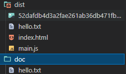

使用 Copy-Webpack-Plugin插件
```javascript

const CopyWebpackPlugin=require('Copy-Webpack-Plugin')
module.exports = {
  
  plugins: [
    new CopyWebpackPlugin([
      {from:'doc',to:'./'}
    ])
  ]
}
```
上述代码可以在打包后将doc目录下的文件放在打包生成的dist目录下

