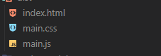

使用`MiniCssExtractPlugin.loader`替换style.loader<br />前提 mode:production<br />对所有文件进行打包 次loader的不同之处在于将css文件单独的分离开

css的代码并不在js内<br />配置文件
```c
const path = require("path")
const MiniCssExtractPlugin = require("mini-css-extract-plugin")
module.exports = {
  entry: "./src/index.js",
  mode: "production",//环境替换为生成环境
     ...
  module: {
    rules: [
      {
        test: /\.(sc|sa|c)ss$/,
        use: [
          MiniCssExtractPlugin.loader,//不再使用style.loader
         
         ...
  plugins: [
    new MiniCssExtractPlugin({
      filename: '[name].[hash].css', // 设置最终输出的文件名  中间的hash可以没有 
      chunkFilename: '[id].css'
    })
  ]
}

```

# 名字带哈希处理

