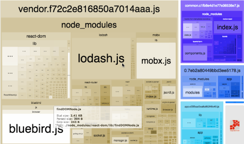

webpack-bundle-analyzer插件可以帮助我们分析打包后的图形化的报表。<br />**仅仅在开发环境使用。**<br />npm install --save-dev webpack-bundle-analyzer<br />配置
```javascript
+ const BundleAnalyzerPlugin = require('webpack-bundle-analyzer').BundleAnalyzerPlugin;
module.exports = {
  plugins: [
    +     new BundleAnalyzerPlugin()
  ]
  }
```
自动生成一个网页报表，如下所示： 


