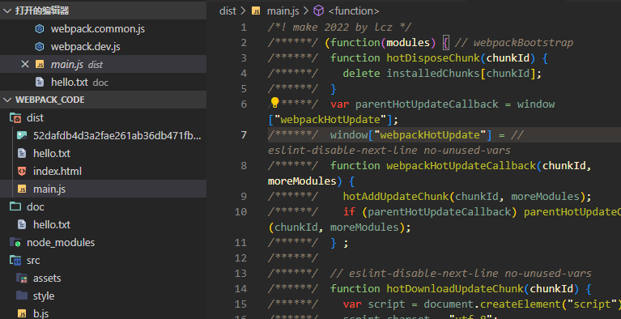

使用插件`bannerPlugin`属于webpack内置插件 并不需要下载<br />配置
```javascript
const webpack = require("webpack")
module.exports = {
  plugins: [ 
    new webpack.BannerPlugin('make 2022 by lcz')
  ],
}

```
生成的js文件开头就会出现填写信息

