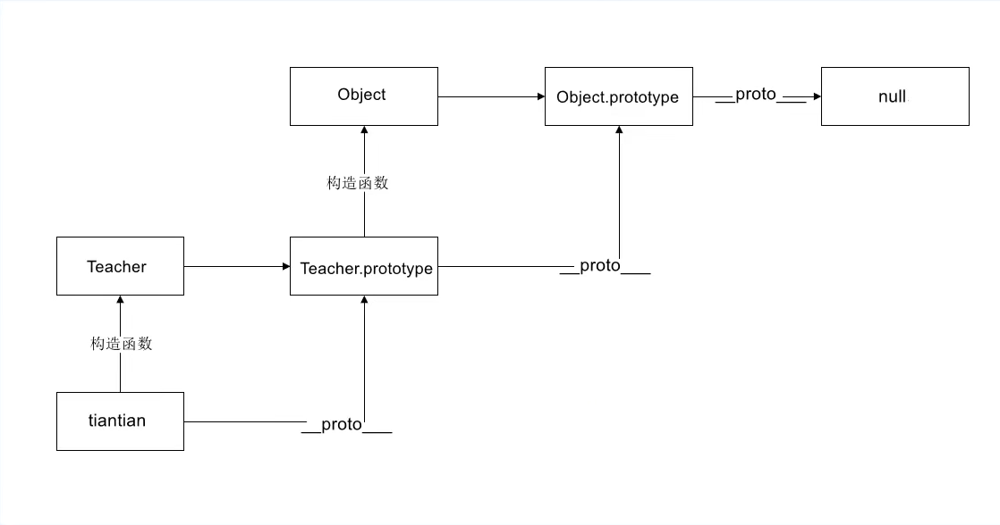
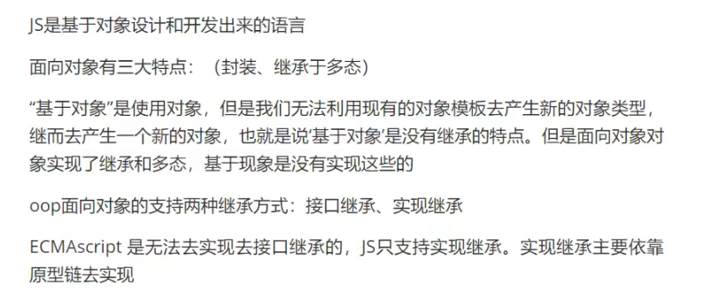

、

# __proto__ 和prototype

1. 属性和方法定义在Object的构造器函数(constructor functions)之上的prototype属性上，而非对象实例本身。
1. __proto__属性是在对象实例和它的构造器之间建立的一个链接
1. 所有的引用类型（数组，函数，对象）可以自由的扩展属性（null除外）
1. 所有的引用类型都有一个__proto__ 属性（隐式原型，它其实就是一个普通的对象）
1. 所有的函数都有一个prototype属性（显示原型，也是一个**普通的对象**）
1. 所有的**引用类型的__proto__ 属性指向它的构造函数的prototype**
1. **当视图得到一个对象的属性时，如果这个对象的本身不存在这个属性，那么就会去它的__proto__ 属性中寻找（去它的构造函数的prototype中寻找）**

**当调用这个对象本身并不存在的属性或者方法时，它会一层一层的往上找，一直找到null（空对象）为止**

