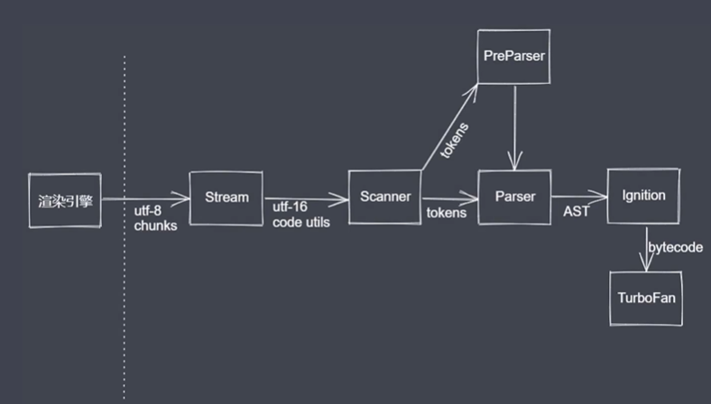
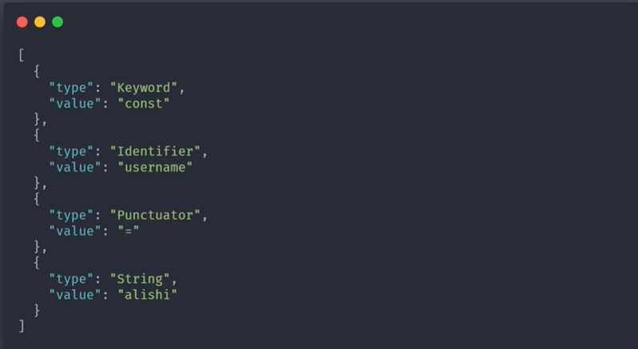
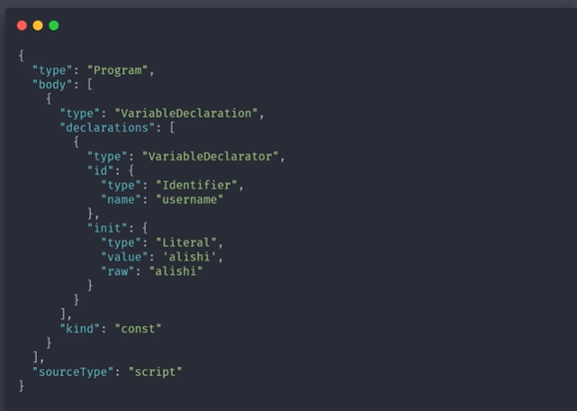
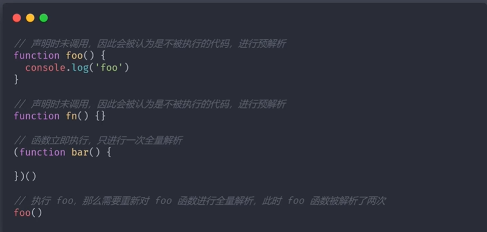

# V8引擎
**编译JavaScript**

## 工作流程


## Scanner（扫描器）
**对纯文本的JavaScript代码进行分析，将其分析成不同的tokens（语法上面无法分割的最小单位，有可能是单个的字符，或者一段字符串，数字等）**
```javascript
const username='alishi'
```
将上述代码扫描为

上述扫描过程叫做**词法分析**

## Parser（全量解析）
**进行语法分析：将词法分析得到的tokens转换成抽象语法树 (Abstract Syntax Tree：**简称 AST，它是源代码语法结构的一种抽象表示。它以树状的形式表现编程语言的语法结构，树上的每个节点都表示源代码中的一种结构**。)**<br />**也会进行语法校验，若有语法错误则会抛出错误**<br />上述代码得出的AST:


## Preparse（预解析）
**JS解析器在执行第一步预解析的时候，会从代码的开始搜索直到结尾，只去查找var、function等内容。一般把第一步称之为“JavaScript的预解析”。**<br />第一步：将变量声明提升至作用域最前面，初始化为undefined。只提升声明，不提升赋值。<br />第二步：将函数声明提升至作用域最前面，初始化为函数块（正式运行前，函数都是整个函数块）。只提升声明，不提升调用。


## Ignition(解释器)
**将AST转化为字节码**

## TurboFans（编译器）
**将字节码转化为汇编代码 ，然后进行代码执行（堆栈执行）**

# 
