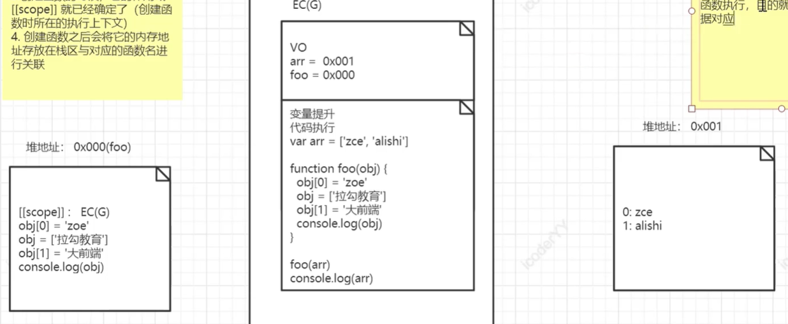

## 函数创建
- 可以将函数名称看做时变量，放在VO中，同时它的值就是当前函数对应的内存地址 	
- 函数本身也是一个对象，创建时会有一个内存地址，空间内存放的就是函数体代码

## 函数执行
**目的就是为了将函数所对应的堆内存里的字符串形式代码进行执行，**<br />**函数在执行时会生产一个新的执行上下文来管理函数体当中的代码**<br />函数执行会形成一个全新私有上下文，它里面有一个AO用于管理这个上下文中的变量<br />步骤：

1. 作用域链<当前执行上下文-->上级作用域所在的执行上下文>
1. 确定this
1. 初始化 arguments
1. 形参赋值：相当于时变量声明，如何将声明的变量放置于AO
1. 变量提升
1. 代码执行



```javascript
开辟一个空间0x001放置arr中的内容
var arr=['zce','alishi']

//开辟一个空间0x000放置函数体 而foo与0x000关联
function foo(obj){
  
  //更改0x001中的zce为zoe
	obj[0]='zoe'
  
  //开辟一个新空间0x002放置["123"],并且让形参指向0x002
  obj=["123"]
  
  //对0x002进行添加值
  obj[1]='太阳'

}

//会生成一个foo的私有上下文
foo(arr)//0x000(0x001)

```

