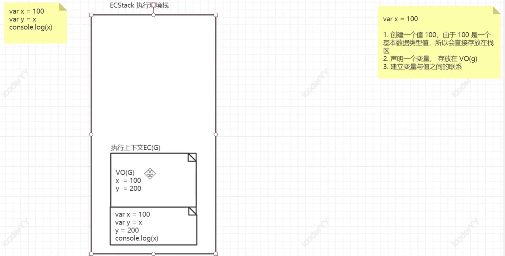

#  堆栈准备

## Js执行环境
V8引擎

## 执行环境栈（ECStack，execution context stack）
浏览器在计算机内存中开辟的一个空间就叫执行环境栈。

## 执行上下文
执行环境栈中的代码不能直接全部放在一起，因为不同区域的代码需要分割开，例如全局变量和局部变量，所以这个时候执行上下文就来管理相应的区域 执行上下文： 就是当前JS代码被解析和执行所在环境的抽象的概念 JS中的任何代码都是在执行上下文中运行的。（执行环境） JS的执行上下文分为三种：

1. 全局执行上下文（默认的，最基础的执行上下文）
1. 函数执行上下文（函数调用的时候会为函数创建一个新的执行上下文）
1. Eval函数执行上下文（能够将符合js标准的字符串当作JS代码执行）

## VO(G),全局变量对象
每个执行上下文的区域中都有一个VO(G)，里面放着全局变量对象，AO(G)，管理函数中的变量

# 堆栈详细

**1.基本数据类型是按值进行操作**

**2.基本数据类型值是直接放在栈区的** 就是不会给基本数据类型分配内存地址和内存空间，会直接放在栈区

**3.无论当前看到的栈内存，还是引用数据类型会使用的堆内存都属于计算机内存**

**4.G0：全局对象** 并不是VO(g)，但是也是一个对象，因此也会有一个内存的空间地址。 是浏览器在计算机内存中申请的多个空间中的一个。（有地址就可以对其进行访问） JS会在GO中准备一个变量叫做window 是一个对象，其中存放着很多我们可以通过JS直接调用的API，例如setinterval setTimeout等等
