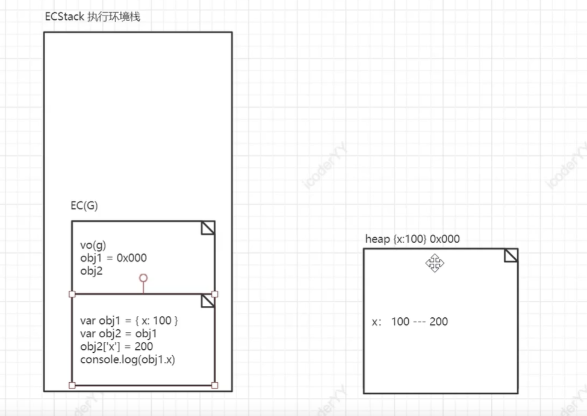
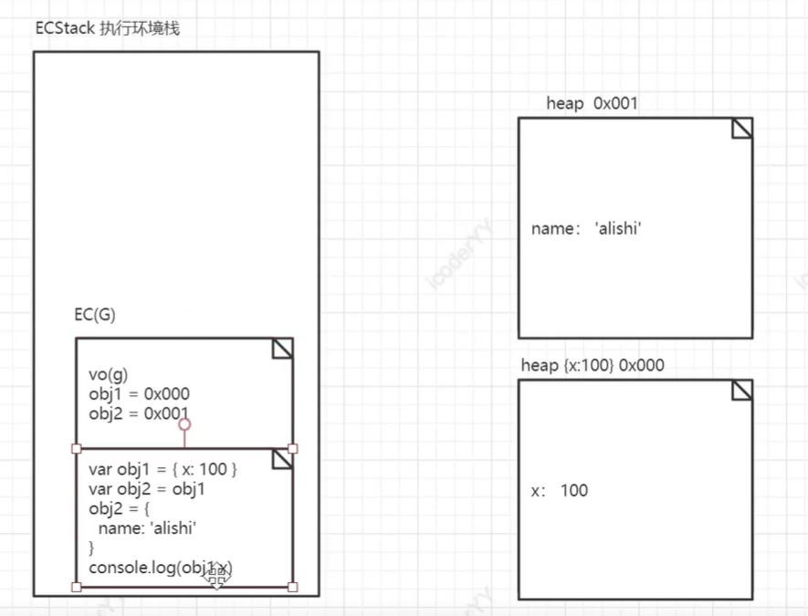
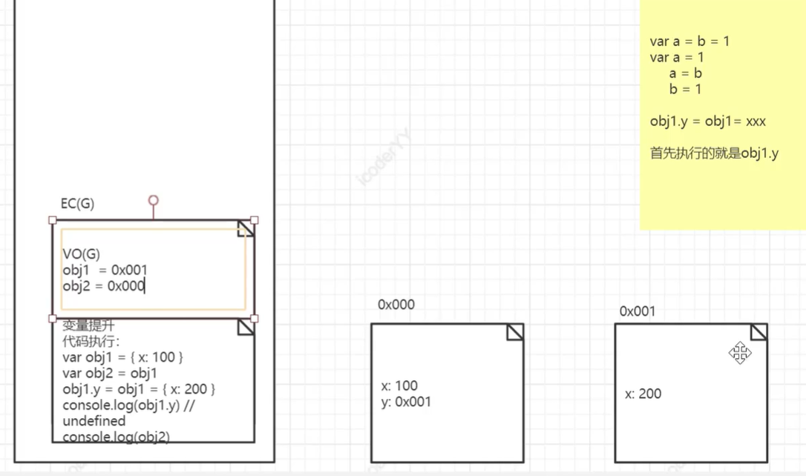

```javascript
//此时开辟了一个空间heap，里面放着x：100，并且让obj1与其相连
var obj1={x:100}

//让obj2与heap相连系
var obj2=obj1

//改变了heap中x的值
obj2.x=200


console.log(obj1.x)//200
```



```javascript
//此时开辟了一个空间heap，里面放着x：100，并且让obj1与其相连
var obj1={x:100}

//让obj2与heap相连系
var obj2=obj1

//开辟了一个新空间heap2，里面放着{name:'alishi'}，并且让obj2与之相连系
obj2={name:'alishi'}


```




```javascript
//此时开辟了一个空间0x000，里面放着x：100，并且让obj1与其相连
var obj1={x:100}

//让obj2与heap相连系
var obj2=obj1

//首先执行obj1.y 会在0x000中加入一个y，并且开辟一个新空间 0x001,内部包含{x:200}，并且让0x000的y和obj1指向0x001
obj1此时指向0x001 obj2依旧还是指向0x000
obj1.y=obj1={x:200}

obj1.y//undefined 
```
