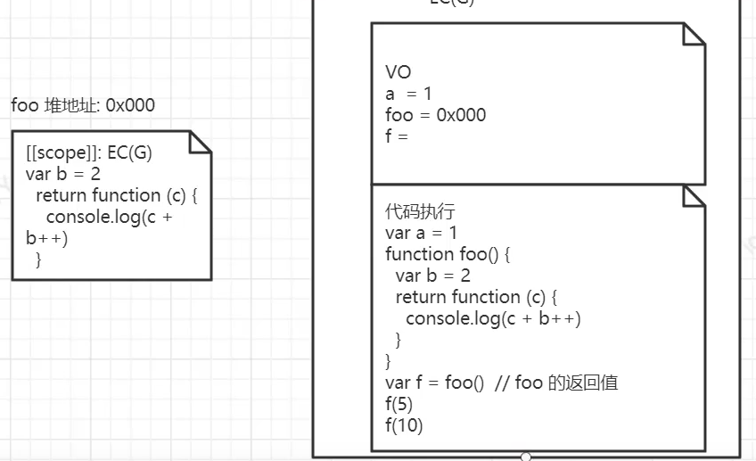
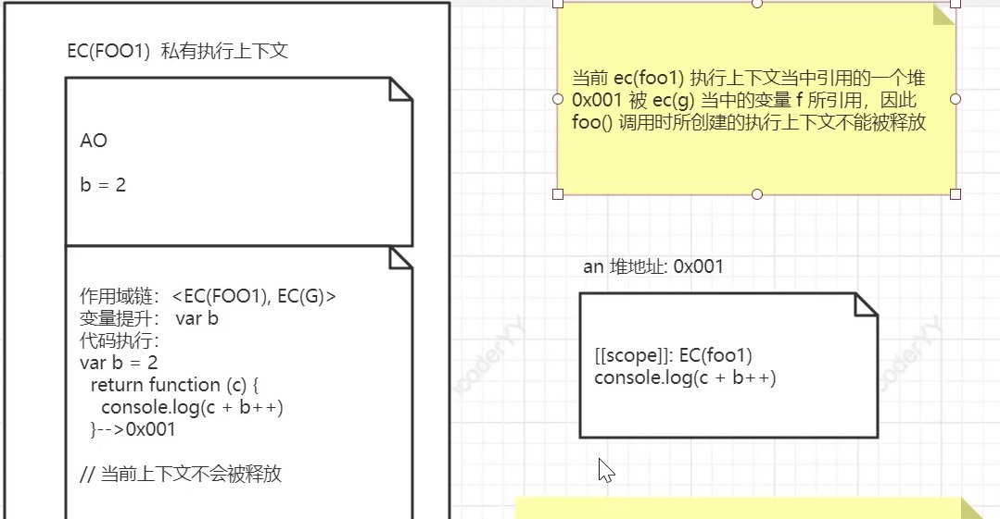

**闭包：**<br />**函数调用形成了一个全新的私有上下文。在函数调用之后当前上下文不被释放就是闭包（临时不被释放）**<br />**闭包是一种机制**<br />**保护：当前上下文当中的变量与其他的上下文中变量互不干扰**<br />**保存：当前上下文中的数据（堆内存）被当前上下文以外的上下文中的变量所引用，这个数据就被保存下来了**




```javascript
//在全局变量中放入 a=1
var a=1

//开辟一个空间0x000 放入foo的函数体
//并且在全局变量中放入foo与0x000相关联
function foo(){
	var b=2
  return function(c){
  	console.log(c+b++)
  }
}

//函数调用有一个私有执行上下文，返回的值为函数 所以新开辟一个空间0x001 放置返回函数的函数体，并return这个地址
//全局变量中就有了f与0x001相关联
var f=foo()//foo的返回值 

f(5)//调用之后开辟一个函数执行上下文 其中b被变量提升至AO  执行时在此上下文中未找到b 所以找到上级作用域 foo的b进行调用 并改变了b的值
//7
f(10)
//13
```
