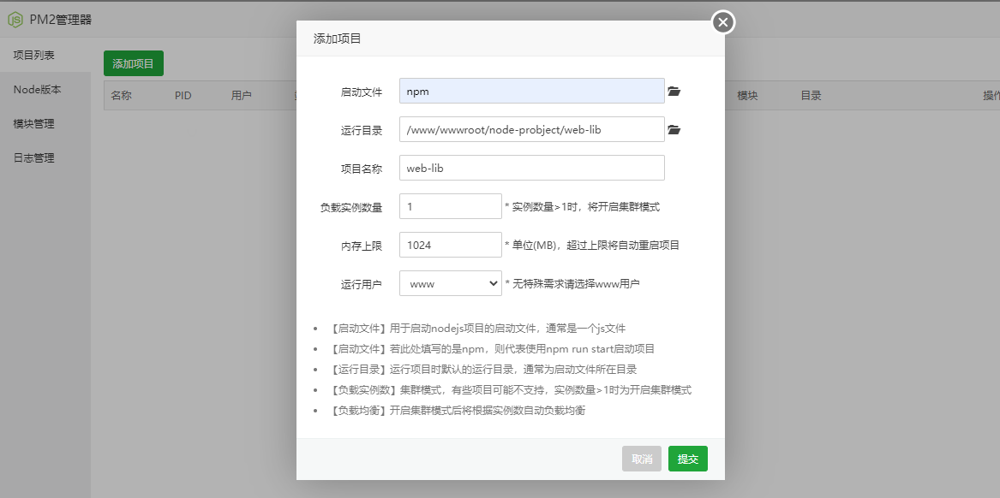
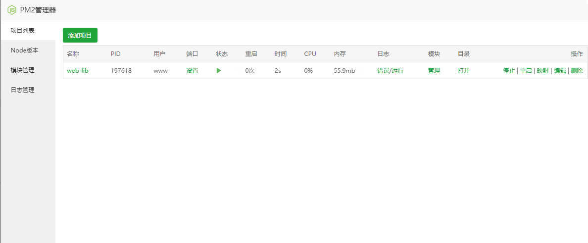

在宝塔中下载PM2管理器

然后添加项目


然后点击管理  一键安装依赖

然后设置端口后到防火墙初开放端口


egg项目一定要用server.js文件启动
```javascript
// server.js
const egg = require('egg');

const workers = Number(process.argv[2] || require('os').cpus().length);
egg.startCluster({
  workers,
  baseDir: __dirname,
});
```
