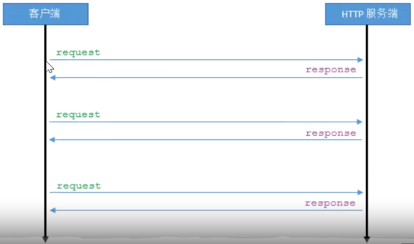
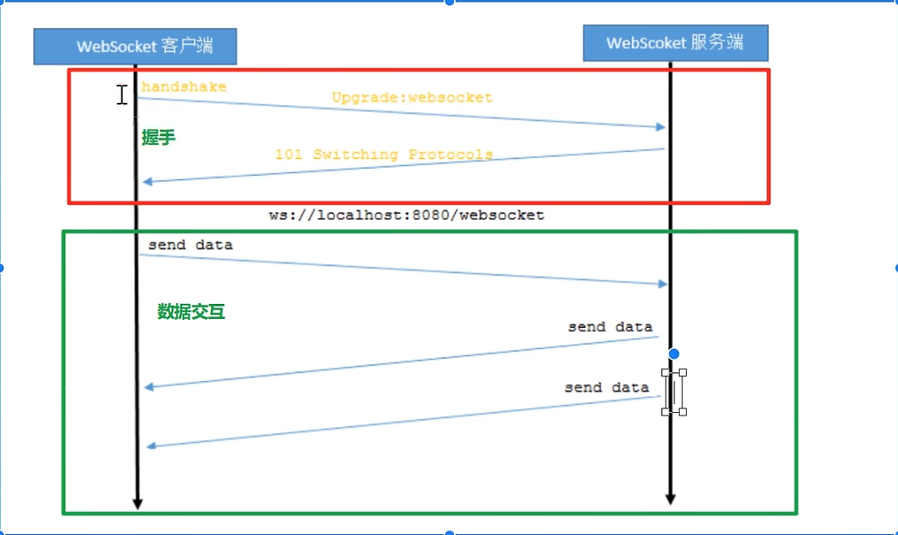
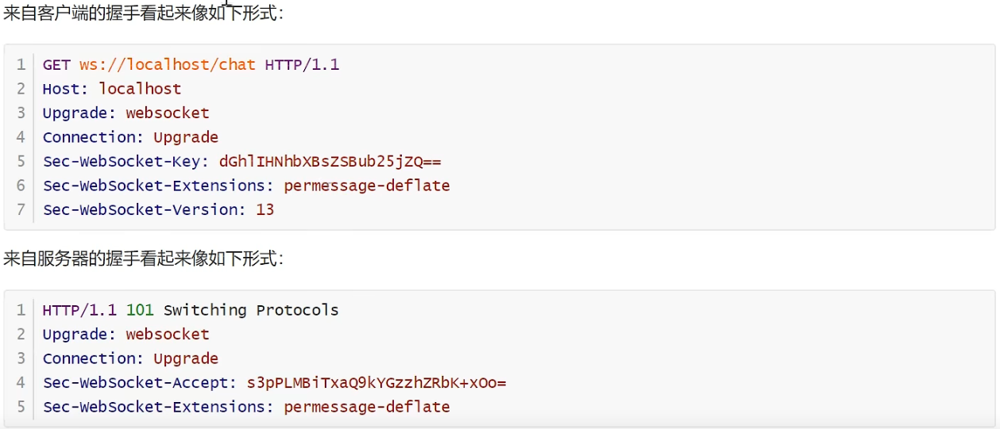
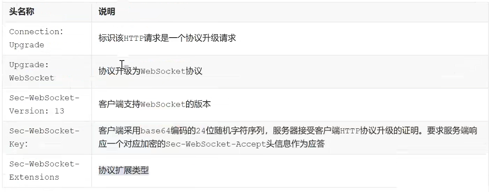
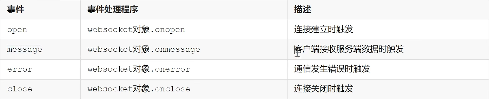
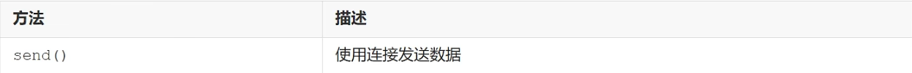

# 1.1 WebSocket介绍
WebSocket是一种网络通信协议。

是HTML5开始提供的一种在单个TCP连接上进行全双工通讯的协议（通讯双方可以同时发送和接受信息）

HTTP协议是一种无状态的，无连接的，单向的应用层协议。采用了请求/响应模型。通信请求只能由客户端发起，服务端对请求做出应答处理。

这种通信模型有一个弊端:**HTTP协议无法实现服务器主动对客户端发送信息**

这种单向请求的特点，注定了如果服务器有连续的状态变化，客户端要获知就非常麻烦。大多数Web应用程序将通过频繁的异步AJAX请求实现长轮询（客服端定时的向服务器发送请求拿到最新的数据），轮询的效率很低，非常浪费资源（因为必须不停的连接，或者HTTP连接始终打开）

http协议：必须需要客户端请求服务器才会给予数据，也并不是实时的数据


**WebSocket协议：**<br />**可以是浏览器主动的向服务器发送数据，也可以是服务器主动的向客户端发送数据**<br />**<br /> **

# 1.2WebSocket协议
本协议有两个部分：握手和数据传输<br />握手是基于http协议的。



字段说明：


# 1.3客户端（浏览器）实现

## 1.3.1 websocket对象
实现WebSockets的Web浏览器将通过WebSocket对象公开所有必需的客户端功能（支持HTML5）<br />用于创建WebSocket的API：
```javascript
var ws=new WebSocket(url)//http地址
```

## 1.3.2 websocket事件
相关事件：



## 1.3.2websocket方法
相关方法：


